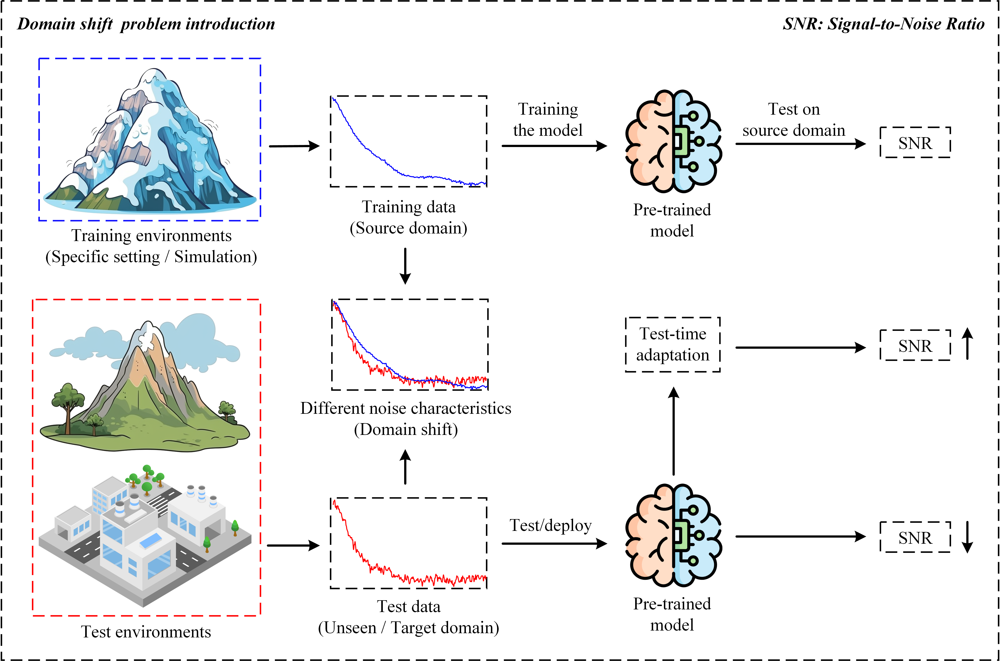

# DP-TTA: Test-time Adaptation for Transient Electromagnetic Signal Denoising via Dictionary-driven Prior Regularization

  
*Fig. 1. Illustration of the domain shift problem between source and unseen domains.*

  
*Fig. 2. Overall framework of DTEMDNet and DP-TTA.*

> **Official PyTorch Implementation**  
> IEEE Transactions on Geoscience and Remote Sensing (TGRS), 2025  
> DOI: [10.1109/TGRS.2025.3620531](https://doi.org/10.1109/TGRS.2025.3620531)  
> Authors: Meng Yang, Kecheng Chen, Wei Luo, Xianjie Chen, Yong Jia, Mingyue Wang, Fanqiang Lin  

---

## 🧠 Overview

**DP-TTA** (Dictionary-driven Prior Regularization Test-time Adaptation) is a novel framework for **Transient Electromagnetic (TEM) signal denoising**.  
It mitigates the **domain shift problem** — where noise characteristics vary across geological environments — by integrating **dictionary-driven priors** into **test-time adaptation (TTA)**.  

The core idea is that **TEM signals possess domain-invariant physical properties** (exponential decay and smoothness).  
DP-TTA exploits these as priors to guide dynamic parameter updates during inference, enabling better denoising performance in unseen environments.

---

## ✨ Highlights

- 🔹 **Dictionary-driven Prior Regularization** — explicitly encodes physical characteristics (exponential decay, smoothness).
- 🔹 **Test-time Self-supervised Adaptation** — updates model parameters on unseen test data.
- 🔹 **Three Self-supervised Losses:**
  - `L_denoising`: output consistency  
  - `L_sparse`: sparse code consistency  
  - `L_one-order`: smoothness consistency  
- 🔹 **Unified TTA Objective:**

  \[
  L_{TTA} = \beta_1 (L_{sparse} + L_{one-order}) + \beta_2 L_{denoising}
  \]

- 🔹 Outperforms most TEM denoising methods in both simulation and real-world experiments.

---

## 📁 Repository Structure

```text
.
├── dptta.py                       # DP-TTA main script (test-time adaptation)
├── dptta_utils.py                 # Self-supervised losses, metrics, helpers
├── para_cfg.py                    # Command-line arguments
├── run_dptta_all.py               # Batch runner for TTA configs
├── test.py                        # Evaluation without TTA
├── train.py                       # Pretraining on source domain
│
├── dictionary_learning/
│   ├── Dic_TEM_signal_project.ipynb   # Learn dictionary atoms & sparse codes
│   └── tem_signal_example/
│       └── clean_signal.mat           # Example clean signal
│
├── lib/
│   ├── basic_layers.py            # Core neural blocks
│   └── utils.py                   # 1D↔2D transforms, I/O, batching, metrics
│
└── model/
    ├── DTEMDNet.py                # Main model (CNN + dictionary regression)
    ├── DnCNN.py                   # Baseline CNN
    ├── Resnet6.py                 # Baseline ResNet6
    └── Resnet9.py                 # Baseline ResNet9
```

> ⚠️ Before running, **update the placeholder paths** in `train.py`, `test.py`, and `dptta.py` (e.g., "your prepared dictionary data path", "pretrained model path") to your actual files.

---

## ⚙️ Setup

### 1) Create the Conda Environment

```bash
conda env create -f environment.yml
conda activate dptta
python -c "import torch; print(torch.cuda.is_available(), torch.version.cuda, torch.__version__)"
# Expected: True 11.3 1.10.0 or you can configure a higher version.
```

---

## 🧩 Dictionary Learning (Source-domain Prior)

1. Open `dictionary_learning/Dic_TEM_signal_project.ipynb`.  
2. Train dictionary atoms and sparse codes using **source-domain clean** signals.  
3. Save to `.mat` files and set the paths in code.

> The **number of atoms (K)**, sparsity level, and more **should follow the paper**.

---

## 🧠 Source-domain Pretraining

1. Edit `train.py` to set:  
   - Source-domain dataset path(s)  
   - Model save path  

2. Run:

   ```bash
   python train.py
   ```

---

## 🧪 Evaluation (Without TTA)

Edit `test.py` to set:  
- Test dataset path(s)  
- Dictionary / sparse code paths  
- Pretrained model checkpoint  

Then:

```bash
python test.py
```

Results (e.g., SNR/MSE/MAE) are exported to Excel (via `openpyxl`).

---

## 🚀 Test-time Adaptation (DP-TTA)

> Please **see the paper** for the recommended settings (learning rate, loss weights, batch size, augmentation intensity, etc.).

Run DP-TTA:

```bash
python dptta.py [your-args-here]
```

Or run a simple sweep:

```bash
python run_dptta_all.py
```

> The script performs **one-step optimization per test batch** to stabilize online adaptation.

---

## 📘 Citation

If you use this repository or build upon DP-TTA, please cite:

```bibtex
@ARTICLE{11201882,
  author={Yang, Meng and Chen, Kecheng and Luo, Wei and Chen, Xianjie and Jia, Yong and Wang, Mingyue and Lin, Fanqiang},
  journal={IEEE Transactions on Geoscience and Remote Sensing}, 
  title={DP-TTA: Test-time Adaptation for Transient Electromagnetic Signal Denoising via Dictionary-driven Prior Regularization}, 
  year={2025},
  volume={},
  number={},
  pages={1-1},
  keywords={Noise reduction; Noise; Adaptation models; Signal denoising; Training; Mathematical models; Data models; Signal processing algorithms; Signal to noise ratio; Electromagnetics; Transient Electromagnetic Signals Denoising; Dictionary Learning; Test-time Adaptation; Deep Learning},
  doi={10.1109/TGRS.2025.3620531}
}
```

---

## 📜 License & Acknowledgements

- Released for **academic & research** use.  
- For dataset details and experimental protocols, **see the paper**.  

---

## 📬 Contact

For issues and questions:  
- Please open a GitHub Issue, or  
- Contact the corresponding author listed in the paper.

**Last Updated:** October 2025  
**Maintainer:** *Meng Yang et al.* (IEEE TGRS 2025)
